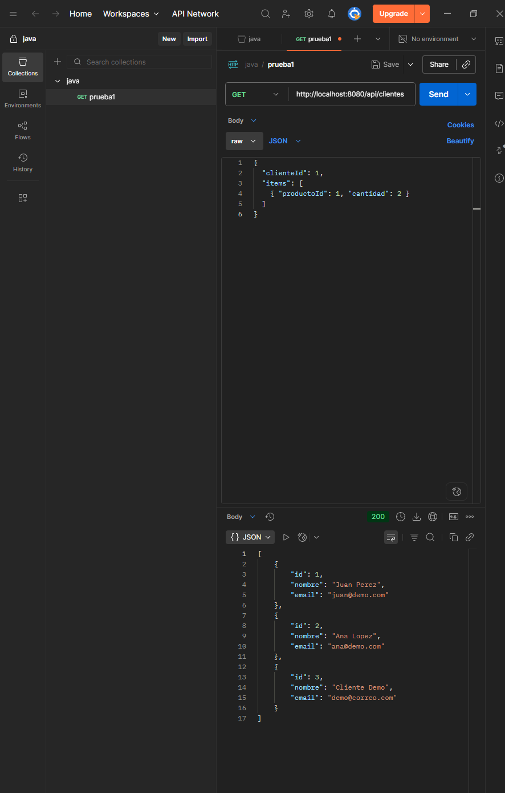
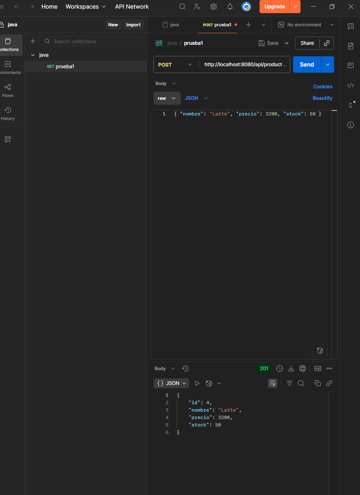
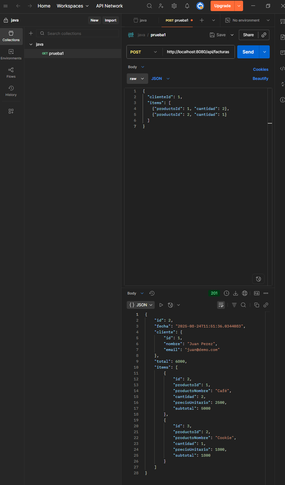
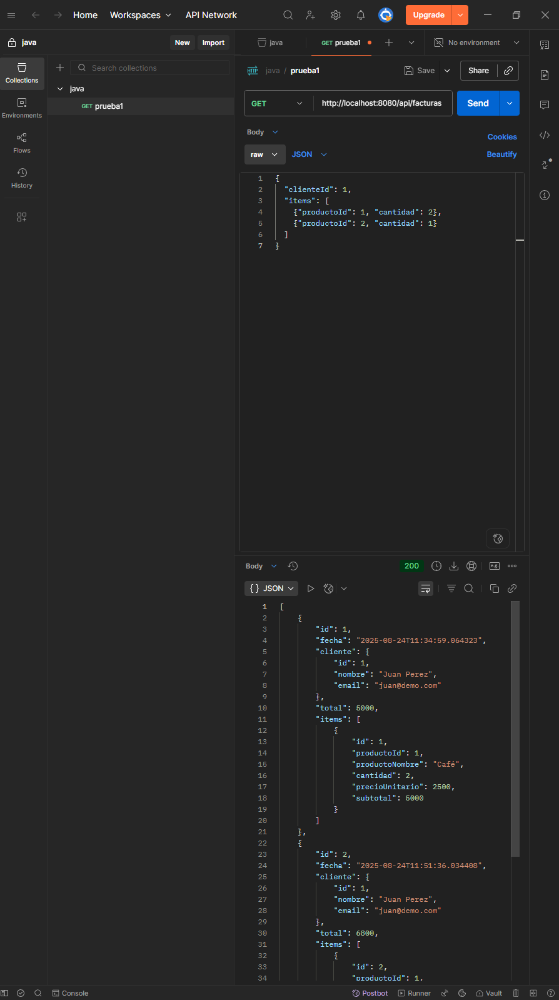
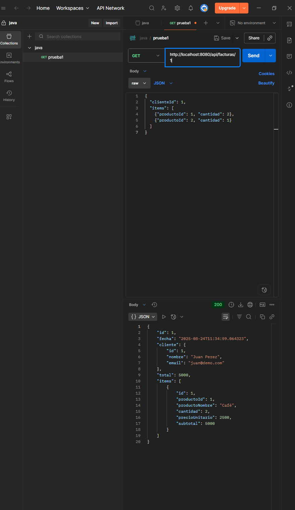
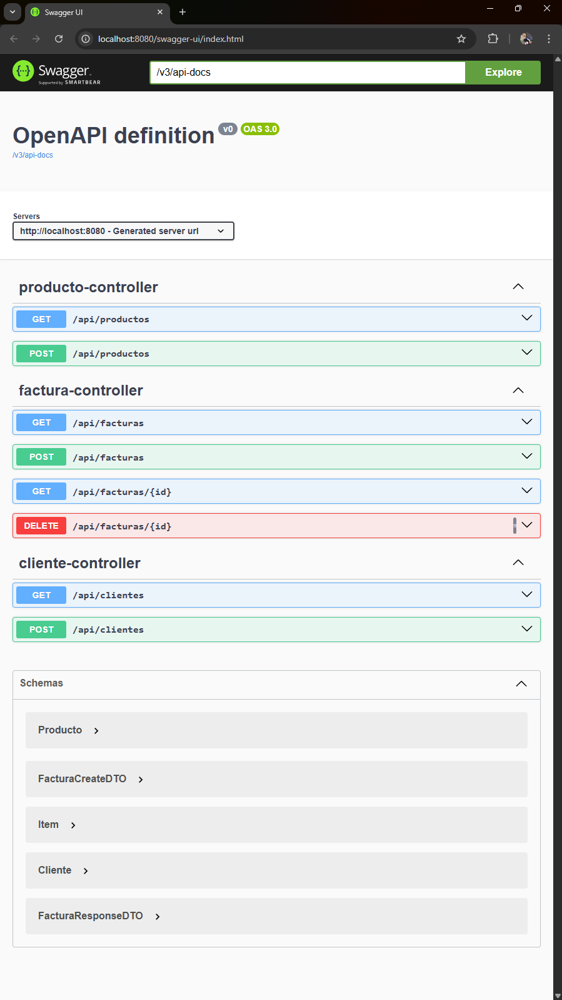
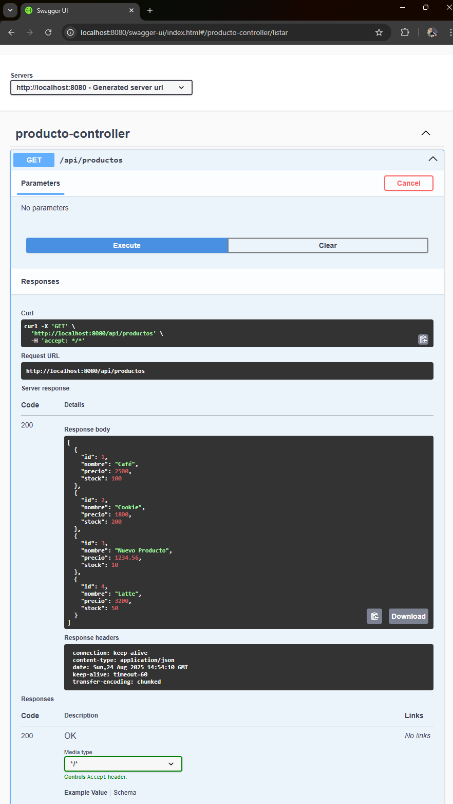
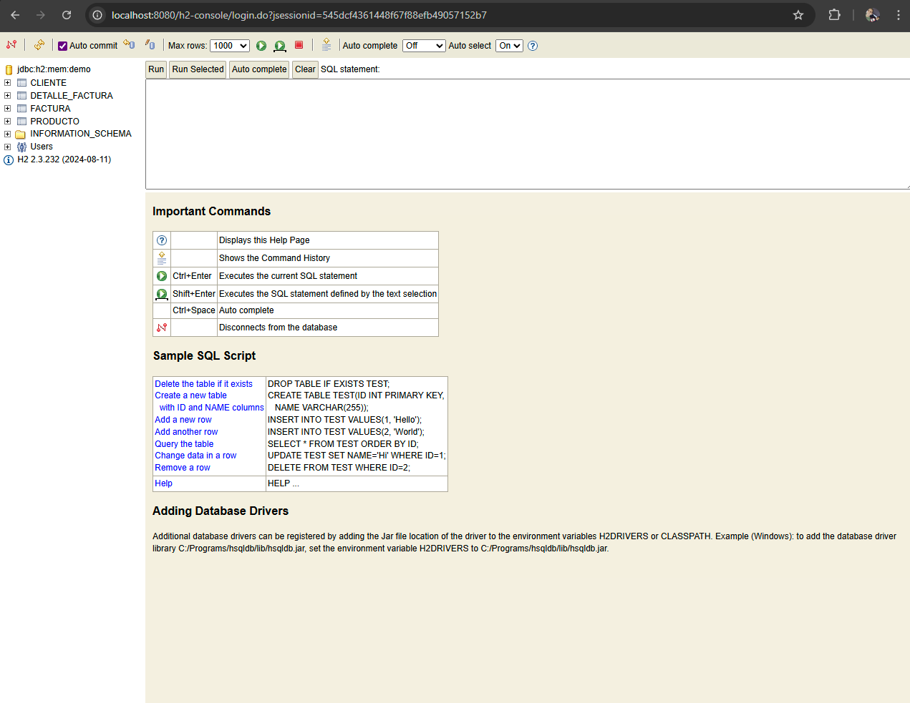

# FacturacionFinalDaddario

API REST profesional para facturación, desarrollada con Spring Boot 3.2.5, H2, JPA, DTOs, manejo de excepciones y documentación Swagger/OpenAPI.

## Cómo ejecutar

1. Compilar el proyecto:
   ```bash
   ./mvnw -q -DskipTests package
   ```
2. Ejecutar el JAR:
   ```bash
   java -jar target/FacturacionFinalDaddario.jar
   ```

## Endpoints principales

### Productos
  ```json
  {
    "nombre": "Nuevo Producto",
    "precio": 1234.56,
    "stock": 10
  }
  ```

### Clientes
  ```json
  {
    "nombre": "Cliente Demo",
    "email": "demo@correo.com"
  }
  ```

### Facturas
  ```json
  {
    "clienteId": 1,
    "items": [
      { "productoId": 1, "cantidad": 2 }
    ]
  }
  ```

## Colección de Postman
La colección de Postman para probar la API se encuentra en `postman/REST API basics- CRUD, test & variable.postman_collection.json`.
## Swagger UI

Accedé a la documentación interactiva en:
[http://localhost:8080/swagger-ui/index.html](http://localhost:8080/swagger-ui/index.html)

## Base de datos H2

Consola disponible en:
[http://localhost:8080/h2-console](http://localhost:8080/h2-console)

- JDBC URL: `jdbc:h2:mem:demo`
- Usuario: `sa`
- Contraseña: *(vacío)*

## Test básico (opcional, suma puntos)

Archivo sugerido: `src/test/java/com/daddario/facturacion/FacturaControllerTest.java`

```java
package com.daddario.facturacion;

import org.junit.jupiter.api.Test;
import org.springframework.beans.factory.annotation.Autowired;
import org.springframework.boot.test.autoconfigure.web.servlet.AutoConfigureMockMvc;
import org.springframework.boot.test.context.SpringBootTest;
import org.springframework.http.MediaType;
import org.springframework.test.web.servlet.MockMvc;

import static org.springframework.test.web.servlet.request.MockMvcRequestBuilders.*;
import static org.springframework.test.web.servlet.result.MockMvcResultMatchers.*;

@SpringBootTest
@AutoConfigureMockMvc
class FacturaControllerTest {

  @Autowired MockMvc mvc;

  @Test
  void crearYListarFacturas() throws Exception {
    // crear
    String body = """
      {"clienteId":1,"items":[{"productoId":1,"cantidad":1},{"productoId":2,"cantidad":2}]}
      """;
    mvc.perform(post("/api/facturas")
        .contentType(MediaType.APPLICATION_JSON)
        .content(body))
       .andExpect(status().isCreated())
       .andExpect(jsonPath("$.id").exists());

    // listar
    mvc.perform(get("/api/facturas"))
       .andExpect(status().isOk())
       .andExpect(jsonPath("$[0].id").exists());
  }
}
```

---

¡Listo para entregar!

## Evidencias de pruebas

Las capturas de las pruebas realizadas en Postman y Swagger se encuentran en la carpeta `evidencias/`.

Ejemplo:









